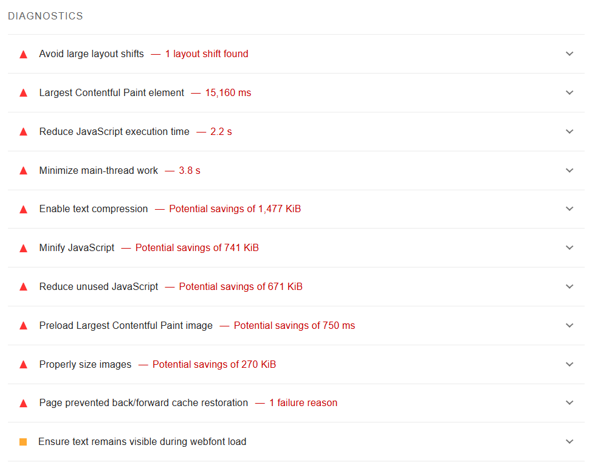
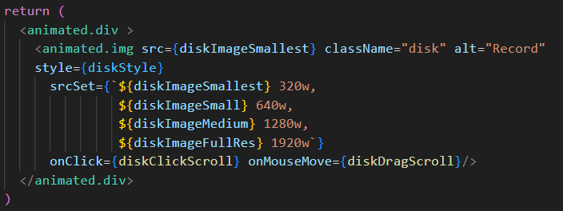
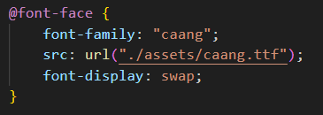
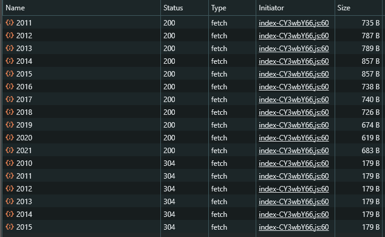

# Performance Report for 'On The Record'

## Initial report

Performance was gathered via Lighthouse in devtools on Chrome, and the application's usage on Firefox and on Safari on a mobile device.

The following was our first Lighthouse run during Milestone 2, netting a score of 60. There are some things to note here, such as the fact that the website was in develop mode when this was ran. Thus, many of these issues were actually solved by vite and rollup when the project is in production mode.



Let's look into how we fixed some of these issues.

## Summary of changes

### Properly sized images
Our first fix was modifying the disk's image element to feature a srcset of smaller images. It initially only had an image of it's full resolution (1920 x 1920) and so from there three more images of decreasing resolutions.




### Visible text during font load
Following that, there was quick css required for our imported font otherwise the text of that font would be invisible until the typography loaded. The following line was added to circumvent this problem.
```css
font-display: swap;
```

 

### Text Compression
From there, the next step is to enable text compression on the server side. This was also a relatively simple change. After reading some documentation, the fix was found to be as follows:
```js
import compress from 'compression';

const app = express(); 
 
app.use(compress());
```
This was also a very large improvement for the Lighthouse report. Lighthouse went from 71-82 after this change alone. This makes sense, as the app requests a somewhat large amount of data from the server, so compressing it would pay off in dividends.

### Caching
Finally, to minimize the time for the client from sending a request for data to the server and receiving it and display it, caching plays an important role. By simply including this piece of code before send back the json from the server
```js
res.set('Cache-Control', 'public, max-age=604800');
```
The server now will cache the data for 1 week, and when another request comes in, it will just send back a 304 if the cache hasn't expired, which will reduce the size of the payload


By having a clear idea of how nodes are being render on a web page and how datas are being send and receive, we can make some minimal but important changes to our website that has massive performance improvement.