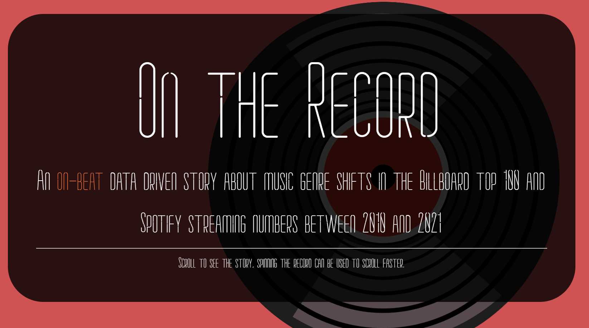
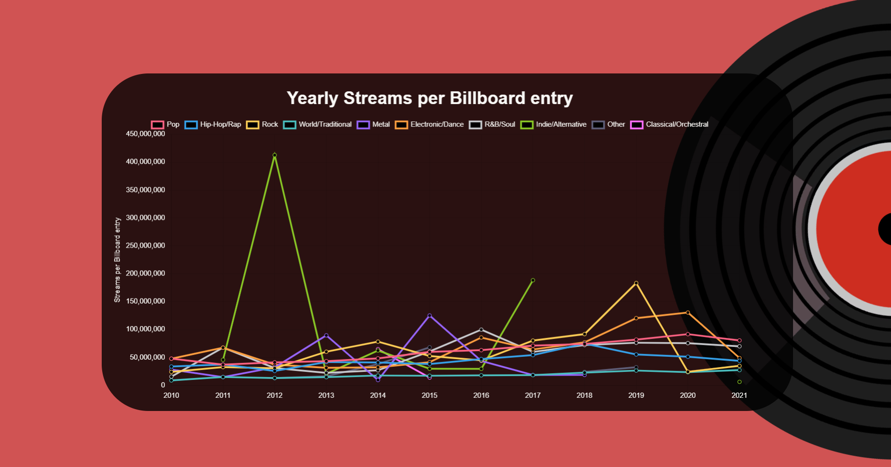

# On The Record

## Wait, what's 'On The Record'?

On the record is a single website with a simplistic design with the goal of bringing data about streaming and the billboard top 100 into a readable form to provide our users with new knowledge about music genre shifts between 2010 and 2021. It's a data-driven story about the music industry and landscape which can be experienced before you finish your favourite EP.




## Setup
To build app
``` bash
cd ./client/; npm run build
```

To begin server
``` bash
cd ./server/; node bin/www.js
```

Then simply access localhost:3000/ with your browser of choice where the website is being held

## API
- `/api/genre/all/:year` This returns all the genre objects from a given year.
- `/api/genre/:genre` This returns all the genre objects of given genre with the data from all years.
- `/api/genre/:genre?year="20XX"` This returns the genre object with the data of that certain year, this example wants a genre from 2017.
- `/api/billboard/` return a list of songs and their genres that were on the billboard top 100 for each year.
- `/api/billboard/?year=20XX` return a list of songs and their genres that were on the billboard top 100 in a given year.
- `/api/streams/top/:year` returns a ranked list genres based on how many streams songs under that genre released in a given year add up to.

## Attributions

- [Top Streamed Spotify songs 2010-2023](https://www.kaggle.com/datasets/irynatokarchuk/top-streamed-spotify-songs-by-year-2010-2023)
- [BillBoard top 100 over the years](https://www.kaggle.com/datasets/dhruvildave/billboard-the-hot-100-songs). 
- [ChartJS](https://www.chartjs.org/)