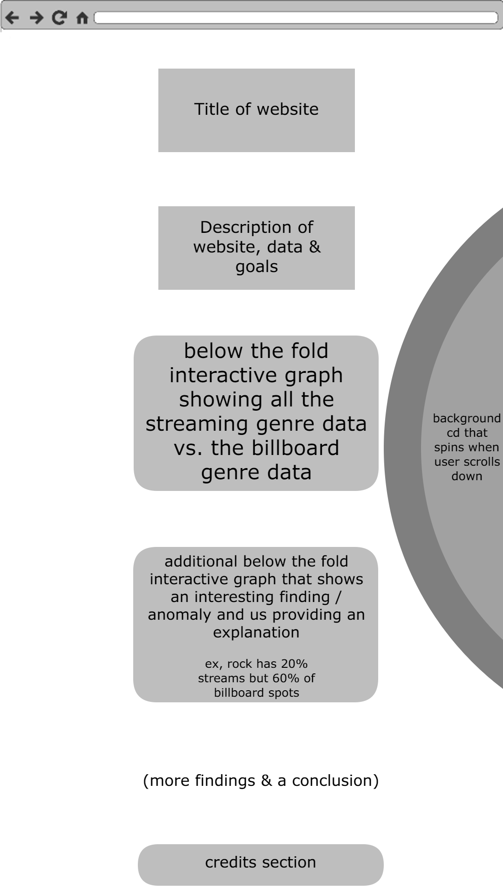
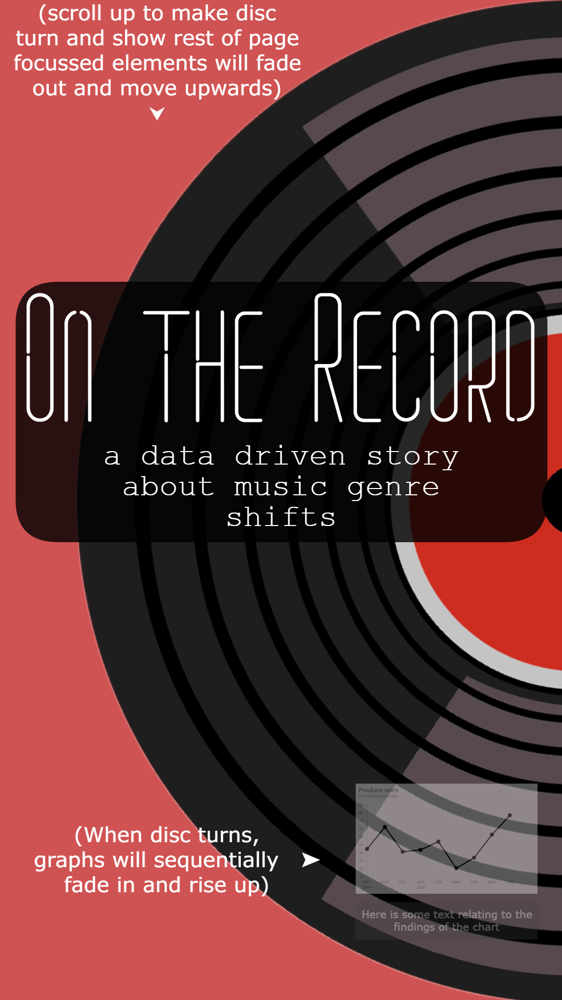
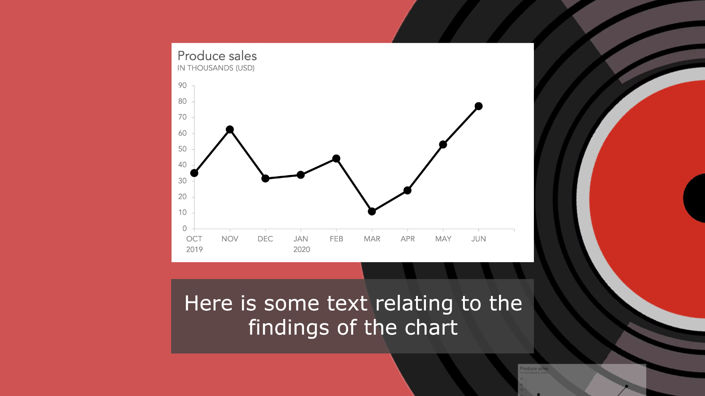

# Music Streams vs. Billboard

## [Data](https://gitlab.com/dawson-csy3-24-25/520/section3/teams/GroupENathanSafinMinh/520-project-safin-nathan-minh/-/issues/1)

Our two chosen datasets are [Top Streamed Spotify songs 2010-2023](https://www.kaggle.com/datasets/irynatokarchuk/top-streamed-spotify-songs-by-year-2010-2023) and [BillBoard top 100 over the years](https://www.kaggle.com/datasets/dhruvildave/billboard-the-hot-100-songs). We intend to relate these datasets by comparing ratios of genres between streaming numbers and spots on the billboard top 100 to see trends in different genres.

## API

- `/api/genre/:genre` This returns all the genre objects with the data from all years.
- `/api/genre/:genre?year="20XX"` This returns the genre object with the data of that certain year, this example wants a genre from 2017.
- `/api/billboard/` return a list of songs and their genres that were on the billboard top 100 for each year.
- `/api/billboard/?year=20XX` return a list of songs and their genres that were on the billboard top 100 in a given year.
- `/api/streams/top/:year` returns a ranked list genres based on how many streams songs under that genre released in a given year add up to.

## Visualization
The User will learn about the correlations between song streams, their genre and their ranking on the billdboard "The Hot 100" to see if different genres are represented differently in popularity vs Billdboard top 100 placement.

ex, if pop has 30% of all stream listens, are pop songs 30% of the billboard top 100?
## Views
The website is one page with several views which the user can see by scrolling further down. Above the fold is the project description and title, along with the background element of the interactive record. Most of the project, including it's graphs and data, lie below the fold in an effort to give the site a more artistic visual feeling, letting the user feel like they're being drawn into the story of the data as it enters the screen.

## Functionality

- When a user scrolls through the website, A graph will be in focus and soon fade in/out depending on the year they are in.
- A rotating Vinyl disc that acts like an aesthetic scrollbar to make it feel like the story is unfolding to the user.
- The user will additionally be able to use their mouse to spin the vinyl record to quickly navigate up or down

## Features and Priorities

Core Feature:
- An Interactive Graph showing the music Data of a certain year
- A single webpage setup to allow the website to be controlled almost entierly by scrolling through the graphs.
- The Vinyl spinning along with the user's scrolling

Optional Features:
- Mouse making the Vinyl Spin
- Extra visual effects such as the spinning and fading in introduction of the graphs.

## Dependencies

- We'll be using [Chart.js](https://www.chartjs.org/) as our graphics library of choice to display our data. We feel that it's simplistic look, animation support, and litany of clean options for charts is exactly what we are looking for. We noticed that the library doesn't support using SVG to make custom graph images which could be an issue as we were throwing around the idea of using some custom images to show important data in a more personalized way. Keeping note of this however, Chart.js is our current library of choice.